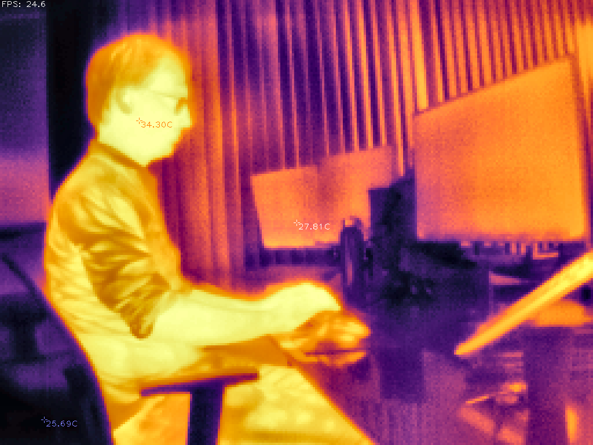

# t2s_hacklib

Python library for [T2S+ thermal camera](https://www.banggood.com/freegift/INFIRAY-T2S+-Thermal-Imaging-Camera-256192-for-Smart-Phone-Type-C-Connector-PCB-Floor-Heat-Inspection-Infrared-Thermal-Imager-p-1990350-40.html).

This is based on [ht301_hacklib](https://github.com/ebachard/ht301_hacklib) but we haven't
figured out what most of the metadata means, so we ignore it, for now. This means that you
won't get any real temperature measurements.

```
$ nix-shell ./shell.nix  # or install Python libraries by some other method
$ python3 opencv_tk.py
keys:
    'u'      - calibrate
    'w'      - save to file date.png
```


How it should look like
=======================

**NOTE**: These pictures are with `ht301_hacklib`. We can't do this for T2S+, yet.


```
$ ./opencv.py
```

